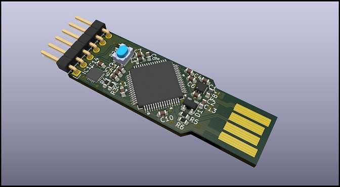
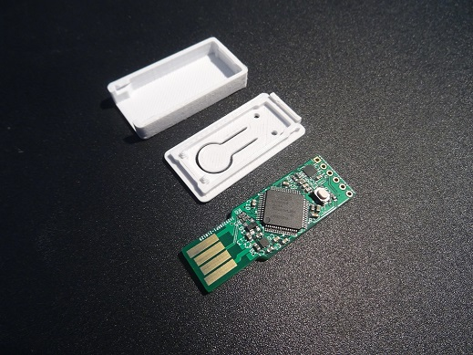
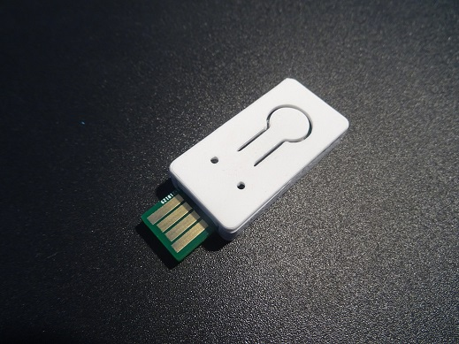

# Yet Another Security Token v1.0


## Purpose of this token
This repository contains the hardware source files of the YAST security token.
This security token is intented to be used as a development platform for security applications.
It is built around a LPC55Sxx chip and a SE050 secure element both from NXP.
This token as the same form factor as the [OpenSK](https://github.com/google/OpenSK) token
from Google therefore its [case](https://www.thingiverse.com/thing:4132768) can be reused.

## Disclaimer
YAST is designed to be a development board and therefore should not be used as a daily security token.

## What is the added value of YAST?
On the market there is already a large amount of security tokens.
Most of them are based on proprietary designs while some others are open source.
On one hand, closed source tokens seem to be based on secure elements while on the other hand, as far as I know, open source tokens
are based on standard, not security certified, chips like STM32 chips.
This design choice seems to be mainly dicted by concerns about NDA which come with Secure Elements.

From my point of view this is a real problem. I agree some tokens based on secure elements are not exempt from vulnerabilities like the [Titan security key](https://www.zdnet.com/article/new-side-channel-attack-can-recover-encryption-keys-from-google-titan-security-keys/) from Google.
In fact, this token is based on a pretty old secure element A7005 from NXP and therefore things which were secure almost ten years ago are no more secure now.
However if a old secure element is now vulnerable (but more than 4 months of work were needed to discover and exploit the vulnerability), old non secure chips are **far more** vulnerables. For example, it is possible to [extract the firmware](https://blog.zapb.de/stm32f1-exceptional-failure/) from an STM32F1 chip using a pure software attack (ok this is not entirely tru as an access to the SWD port is needed). This is this chip which is used in the Nitrokey Start key from Nitrokey. While using a secure element is not a "cure-all",  using non-secure and non-certified chips for secure application is almost always a bad idea as you relies on a "untrusted" (not certified) chip exectuting an "untrusted" (not certified) code. Here openess is not really a huge advantage as there is very few people around the world which have the required skills needed to perform a valuable security assessment of a security token.

So how a security token can be built using a secure element and still be open source? [SE050 security chip](https://www.nxp.com/products/security-and-authentication/authentication/edgelock-se050-plug-trust-secure-element-family-enhanced-iot-security-with-maximum-flexibility:SE050) from NXP is a preprogrammed secure element embedding a really versatile security applet. All documentation is freely accessible on the NXP's website (some documentation requires an account to be accessible) and therefore no NDA is required. 
The YAST key embeds both a LPC55Sxx chip and the SE050 SE. LPC55Sxx chip can be binded to its SE050 companion using its embedded PUF (Physical Unclonable Function). The resulting hardware comes both the flexibility and the power of the LPC55 chip and the security of the SE050 secure lement which has been certified at level EAL6+ (Hardware and OS) according to the Common Criteria

## For which application the YAST token can be used?
You can basically implements any smartcard-like application using this token. For example the development of an OpenPGP card application is on-going.
It should also be possible to implement a FIDO2 application because the key is equipped with a button (however there is no LED). However SE050 has some limitations which can be circumvented:

- PIN object cannot be atomically updated. You have to first delete then create a new PIN object. If a power loss occurs between PIN deletion and creation then the secure element remains in an improper state which can be exploited by an attacker. Therefore my advise is to lock the secure element using the new PIN before the deletion of the old PIN and unlock the SE at the end of the process. In case of power loss during PIN update, the SE is locked at next reboot and the improper state of teh SE cannot be exploited by an attacker which does not have the knowledge of the new PIN.
- PIN try counters of PIN objects cannot be read (while there are effectiveley decremented when a wrong PIN is entered) so you will have to manage these counters by yourself.This limitation is corrected in the new version of the SE050 which is not yet available.

At the moment, due to a shortage in LPC55S69 chips, YAST token is based on a LPC55S28 chip which does not implement TrustZone.
However these two chips are PIN compatible and token design does not need to be changed if one wants to update the chip.

## Building the YAST token yourself
You can easily build this token yourself. The token is designed using Kicad v5 and you can inspect or modify its design.
You will need a PCB with a thickness of at least 2.0mm (best 2.4mm). You can also use a small piece of tape to improve the thickness of your PCB.
You should dispense paste on the PCB using a stencil. I use unleaded low temperature Chip Quik SMDLTLFP paste (melting point at 138°C).
Placement is not so hard because CMS are not smaller than 0603. The regulator, the SE050 and the LPC55 are the hardest parts to place.
Soldering is an easy game if you use an hot plate and an hot-air rework station.

## Programming and debugging
A 6-pin header is available for programming and debugging purpose through LPC55 SWD port. A low cost [LPC Link-2](https://www.nxp.com/design/microcontrollers-developer-resources/lpc-microcontroller-utilities/lpc-link2:OM13054)
from NXP can be used as a debugging probe. You should update it with the [segger firmware](https://www.segger.com/products/debug-probes/j-link/models/other-j-links/lpc-link-2/) to obtain the best performaces.
USB port can also be used to program the LPC55 chip through the on-chip bootloader:

1. First you will have to enable the USB0 interface in the bootloader configuration. To do so, you can load and exectute the following [piece of code](docs/unlock_USB0_bootloader.c) trough SWD interface.
2. Once bootloader has been unlocked, press the button on the token and plug it on your computer. Bootloader should be automatically detected on WIN10.
3. Then use [blhost](https://www.nxp.com/design/software/development-software/mcuxpresso-software-and-tools-/mcuboot-mcu-bootloader-for-nxp-microcontrollers:MCUBOOT) tool from NXP to flash your firmware:
    1. Compile your program using your preferred IDE (e.g. MCUXpresso) and generate an HEX file.
    2. Load the new HEX file using the following commands:

```bash
blhost -u 0x1FC9,0x21 -- flash-image <path_to_hex_file> erase 0
blhost -u 0x1FC9,0x21 -- reset
```

## Plastic case for YAST token
This token as the same form factor as the [OpenSK](https://github.com/google/OpenSK) token
from Google therefore its [case](https://www.thingiverse.com/thing:4132768) can be reused.
The case can be built using a 3D Printer and PLA plastic.





## License
This work is licensed under CC BY-SA 4.0
